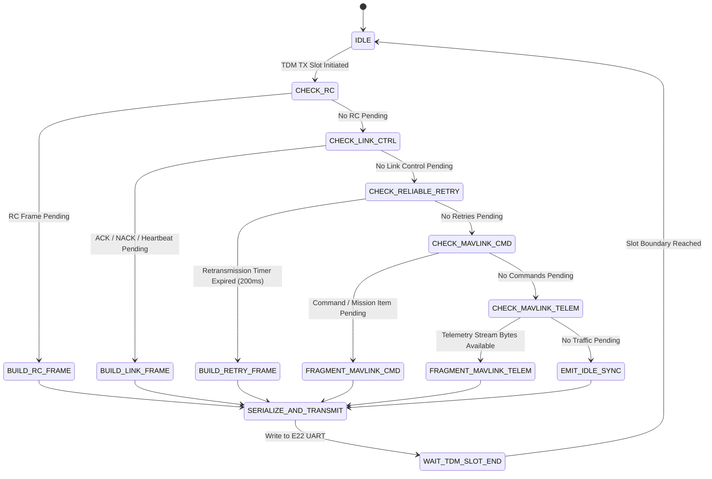
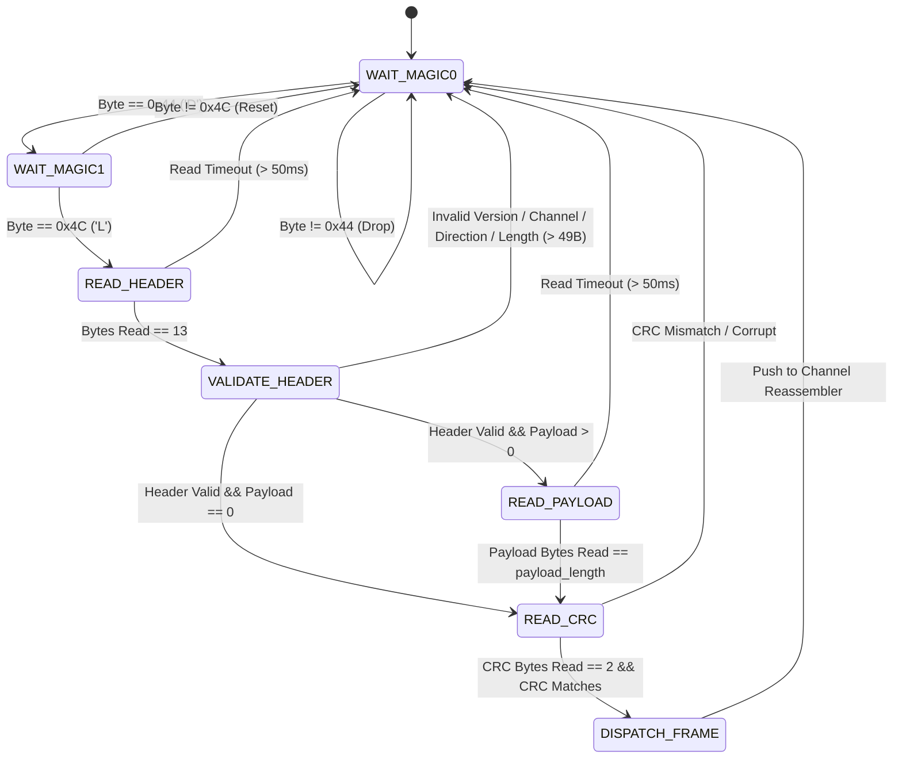
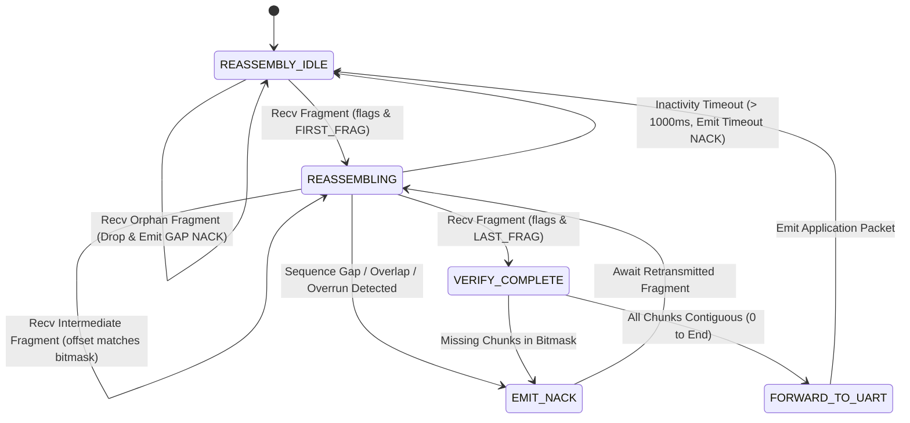
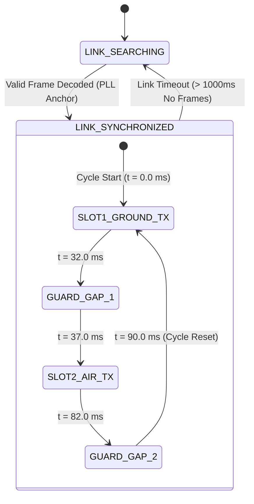
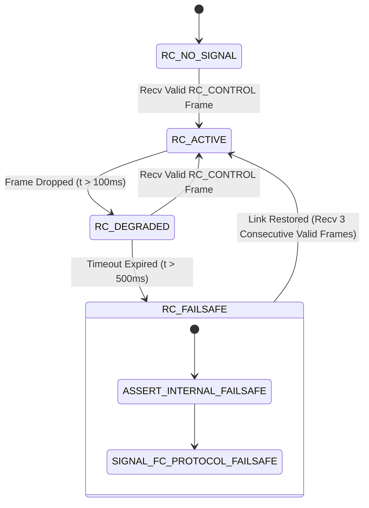

# Dual-LRS Phase 2: Transport Layer State Machines

**Document Version:** 1.2.0
**Status:** Architecture Review Package — Final Revision, No Production Transport Implemented
**Date:** 2026-10-01
**Project:** Dual-LRS

---

## 1. Transmitter Channel Scheduling & Segmentation State Machine

The transmitter state machine coordinates channel priority preemption, fragmentation of application messages into single-burst payloads ($\le 49\text{ B}$), and reliable ACK-tracking:

### State Transitions & Decision Logic

1. **`CHECK_RC` (Priority 1):**
   - Always checked first in the Ground Uplink slot.
   - If an RC frame is available from the RC input parser, it is packed into a 24-byte `TransportPackedRc` payload via consecutive 11-bit little-endian packing ($13\text{B Header} + 24\text{B Payload} + 2\text{B CRC} = \mathbf{39\text{B Frame}}$).
   - Unreliable: `flags = 0`. Does not wait for ACK. Overwritten immediately when next RC frame arrives.
2. **`CHECK_LINK_CTRL` (Priority 2):**
   - Checks pending ACK/NACK or 2 Hz Heartbeat frames.
   - Maximum 23 bytes total frame size ($13 + 8 + 2 = 23\text{B}$).
3. **`CHECK_RELIABLE_RETRY` (Priority 3):**
   - Inspects the active unacknowledged frame buffer.
   - If `current_time - tx_time >= 200 ms` ($2 \times T_{\text{TDM}} + 20\text{ ms}$), re-sends the unacknowledged fragment (`retry_count++`).
   - If `retry_count > 5`, aborts transfer (`statTxTransferAborts++`), clears buffer, and logs error.
4. **`FRAGMENT_MAVLINK_*` (Priority 4 & 5):**
   - Pulls up to **49 bytes** from the application stream.
   - Sets `fragment_offset = current_stream_offset`.
   - If `current_stream_offset == 0`, sets `TRANSPORT_FLAG_FIRST_FRAG`.
   - If stream end reached, sets `TRANSPORT_FLAG_LAST_FRAG`.
   - Guaranteed single-burst frame: $13 + 49 + 2 = \mathbf{64\text{ Bytes}}$.

---

## 2. Receiver Framing & Byte Parser State Machine

The byte-by-byte parser runs in the high-priority radio UART interrupt / poll loop. It validates magic bytes, verifies frame bounds, calculates running CRC-16, checks transmission direction, and dispatches complete frames:

### Parser Rejection Gates & Error Counter Mappings
- **Byte 2 (Version):** `version != 0x01` $\rightarrow$ Drop, increment `statRxUnsupportedVersion`.
- **Byte 3 (Channel & Direction):**
  - If `channel < 0x01 || channel > 0x04` $\rightarrow$ Drop, increment `statRxInvalidChannel`.
  - Direction validation: If `channel` violates role direction (e.g. Ground receiving `RC_CONTROL` or Air receiving `MAVLINK_DOWNLINK`) $\rightarrow$ Drop, increment `statRxInvalidDirection`.
- **Bytes 11..12 (Payload Length):** `payload_length > 49` $\rightarrow$ Drop, increment `statRxPayloadOverrun`. Strictly enforces 64-byte frame ceiling.
- **CRC Validation:** Computed CRC-16 over `[0 .. 12 + payload_length]` must match the 2 trailing bytes $\rightarrow$ if mismatch, increment `statRxCrcErrors`.

---

## 3. Multi-Fragment Stream Reassembly State Machine

Maintained on both Air and Ground units to reconstruct segmented MAVLink packets (up to 512 bytes):

### Reassembly Buffer Contract
- **Capacity:** Strictly 1 active reassembly transfer per direction.
- **Active Transfer Preservation:** If a `FIRST_FRAG` for a different `transfer_id` arrives while a transfer is in progress (`!is_complete`), it is rejected immediately with `NACK_REASON_BUFFER_FULL`. The in-progress transfer is preserved and continues uninterrupted.
- **Completed Transfer Lifecycle:** Once a transfer is complete (`is_complete == true`), the reassembled payload remains intact and readable via `get_reassembled_data()`. The application may explicitly release it via `mark_complete_consumed()`. If a new transfer arrives with `FIRST_FRAG` after completion, the reassembler atomically transitions to the new transfer, replacing the completed buffer. Duplicate chunks of an already-completed transfer continue to be re-ACKed idempotently.
- **Maximum Buffer Size:** 512 bytes (`TRANSPORT_MAX_TRANSFER_SIZE = 512`).
- **Maximum Fragments:** 11 fragments ($\lceil 512 / 49 \rceil = 11$).
- **Inactivity Timeout:** 1000 ms. If no fragments arrive for 1000 ms on an incomplete transfer, buffer is cleared and a NACK with `NACK_REASON_TRANSFER_TIMEOUT` is emitted.
- **Orphan Fragment Rejection:** If a non-first fragment (`flags & FIRST_FRAG == 0`) arrives when no transfer is active or after a previous transfer completed, it is rejected with `NACK_REASON_GAP_DETECTED`.
- **Exact Duplicate Handling:** If an arriving fragment matches an exact previously received range, duplicate memory write is bypassed and an ACK is re-emitted if `TRANSPORT_FLAG_RELIABLE` was set.
- **Partial Overlap Rejection:** If an arriving fragment partially overlaps a previously received range (but is not an exact duplicate), it is rejected with `NACK_REASON_OVERLAP_CONFLICT` without modifying existing buffer memory.
- **Forwarding:** Only when all bytes from 0 to total length are contiguous is the message passed to the FC or GCS UART.

---

## 4. TDM Slot Timing & Phase Synchronization State Machine

Coordinates the half-duplex transmit and receive slots according to the conservative 90.0 ms cycle (~11.1 Hz):

### Timing Arithmetic & Empirical Margins
- **Slot 1: Ground Uplink ($0.0\text{ to }32.0\text{ ms}$, duration $32.0\text{ ms}$):**
  - Ground transmits `RC_CONTROL` ($39\text{B}$) or `LINK_CONTROL` ($21\text{--}23\text{B}$).
  - RC transfer duration: $\approx 28.5\text{ ms}$. Headroom: $32.0\text{ ms} - 28.5\text{ ms} = \mathbf{+3.5\text{ ms}}$.
  - Link control physical transfer time: $21.22\text{ ms}$. Headroom: $32.0\text{ ms} - 21.22\text{ ms} = \mathbf{+10.78\text{ ms}}$.
  - *Correction Note:* The previous 25 ms slot was unapproved because a 28.5 ms transfer cannot fit within 25 ms.
- **Guard Gap 1 ($32.0\text{ to }37.0\text{ ms}$, duration $5.0\text{ ms}$):**
  - Allows Ground E22 AUX to settle to IDLE and Air UART FIFO drain.
- **Slot 2: Air Downlink ($37.0\text{ to }82.0\text{ ms}$, duration $45.0\text{ ms}$):**
  - Air transmits `MAVLINK_DOWNLINK` ($64\text{B}$ total frame, $49\text{B}$ payload).
  - Measured physical one-way transfer time: **$38.68\text{ ms}$**.
  - Headroom: $45.0\text{ ms} - 38.68\text{ ms} = \mathbf{+6.32\text{ ms}}$ safe clearance.
- **Guard Gap 2 ($82.0\text{ to }90.0\text{ ms}$, duration $8.0\text{ ms}$):**
  - Accommodates Air E22 AUX fall time, Ground UART FIFO drain, and PLL clock phase drift re-synchronization.
- **Total Cycle:** $32.0 + 5.0 + 45.0 + 8.0 = \mathbf{90.0\text{ ms}}$ ($\approx 11.11\text{ Hz}$).
- **Disclaimer:** Initial conservative bench proposal; subject to over-the-air validation under real noise and multipath.

### Clock Phase Alignment (PLL)
- **Anchor:** Every valid frame arrival timestamp `t_arrival_us` serves as a phase reference.
- **Phase Offset Calculation:**
  $$\text{slot\_error} = (t_{\text{arrival\_us}} - t_{\text{expected\_slot\_start\_us}})$$
- **Correction:** Adjusts the local microsecond cycle counter by a bounded slew rate ($\le \pm 50\ \mu\text{s}$ per cycle) to eliminate drift between independent microcontroller oscillators.

---

## 5. RC Failsafe State Machine (Decoupled Architecture)

Executed on the Air unit (BlackPill) to safeguard the drone against RF link disruption without encroaching on Flight Controller flight safety logic:

### Decoupled Failsafe Contract
1. **At $t = 100\text{ ms}$ (Degraded):** Maintain last known good RC channel values; increment `statRcLqDrop`.
2. **At $t = 500\text{ ms}$ (Failsafe Asserted):**
   - Assert internal transport failsafe flag (`failsafe_active = true`).
   - Signal the Flight Controller interface via the protocol's native failsafe indicator (e.g. CRSF failsafe bit set in UART output frame, or SBUS failsafe bit).
   - **NO PWM / CHANNEL MANIPULATION:** The transport layer **DOES NOT** force Channel 3 (Throttle) to 900 µs and **DOES NOT** force Channel 5 (Mode) to RTL.
   - The Flight Controller executes its own autonomous failsafe policy (RTL, LAND, HOLD, or TERMINATE) as configured by ArduPilot / Betaflight parameters.
3. **Recovery:** Requires **3 consecutive valid `RC_CONTROL` frames** before clearing the failsafe signal and resuming normal channel forwarding.
